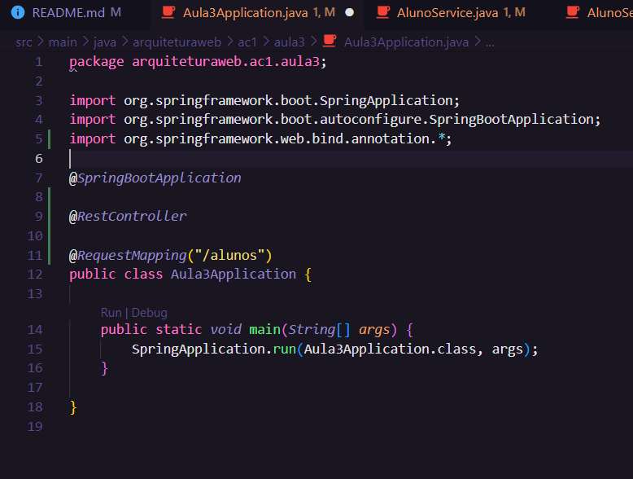
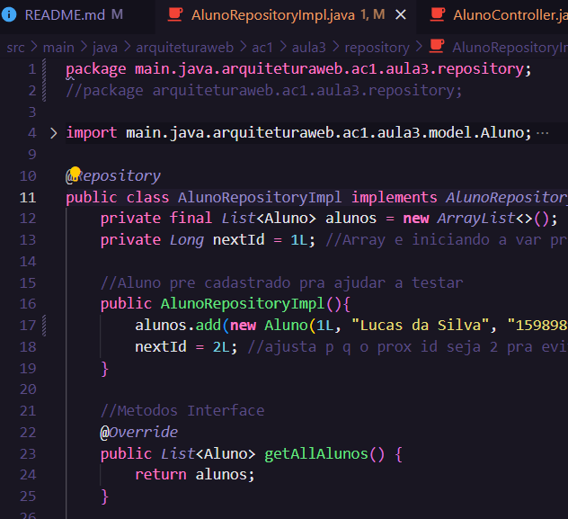
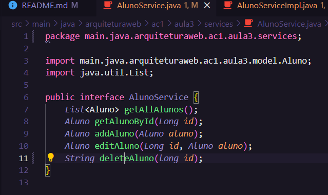
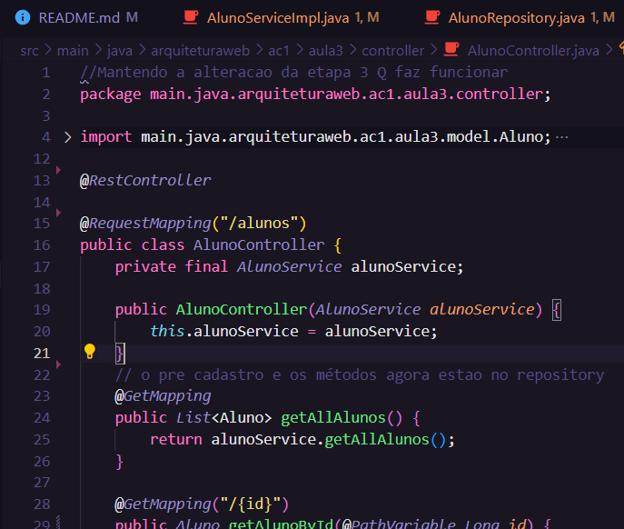
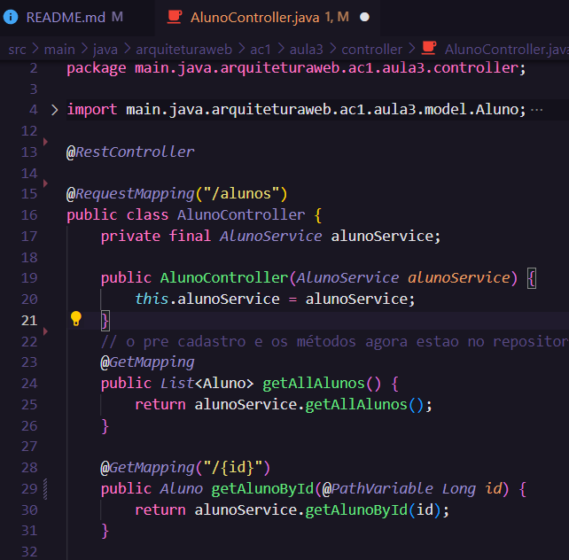

### (Disclaimer para o professor:)
Depois de brigar muito, passar parte do feriado tentanto arrumar o da aula3 eu finalmente pude começar a atividade da aula4. Só que também deu errado não sei por quê. Nada é indicado como erro, tudo roda perfeitamente, o ./gradlew build não acusa um errinho se quer. Só que mais uma vez o Postman só da 404. Eu virei esse código de ponta a ponta a madrugada inteira e simplesmente não sei o que tá errado, acho que é mais alguma coisa específica e absurda como foi o da aula3.

# AC1 - Etapa IV - Inversão de Controle e Injeção de Dependências
Nessa etapa, foram criadas as interfaces, repositórios e services, além de um retrabalho nos métodos da versão anterior.

## Classes
### Classe Main

### Interface Repository

### Implementação Repository

### Interface Service

### Implementação Service

### Nova versão do Controller

## Requisições
Como eu mencionei anteriormente, não deram certo.

