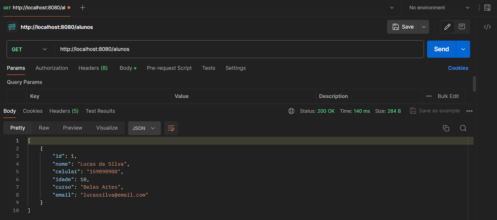
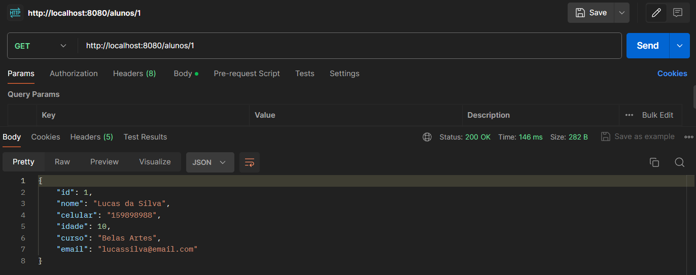
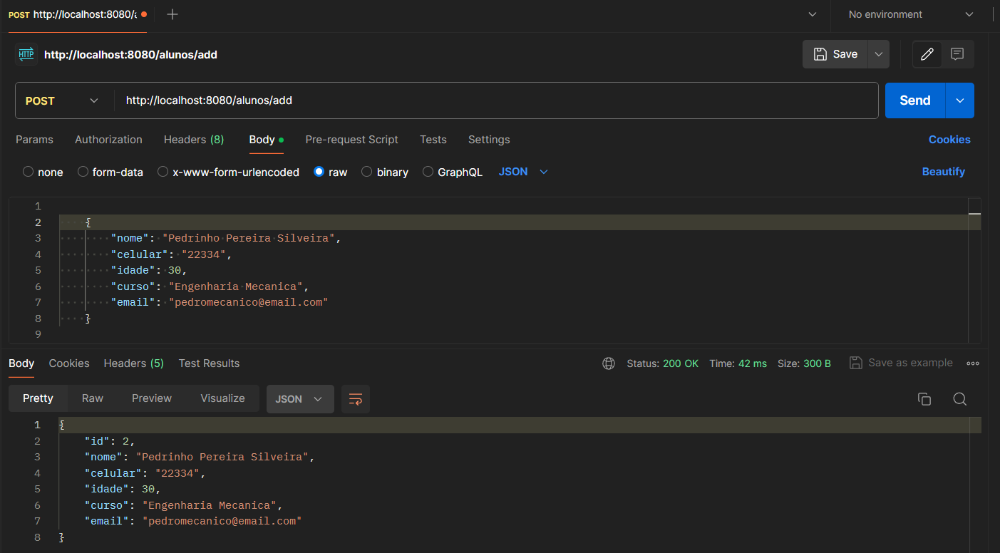
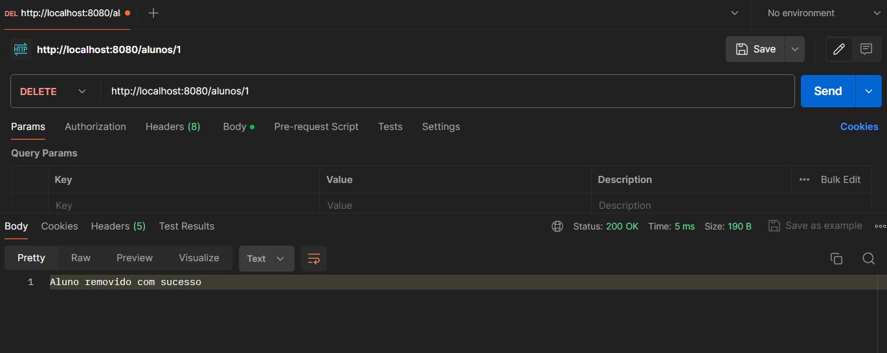
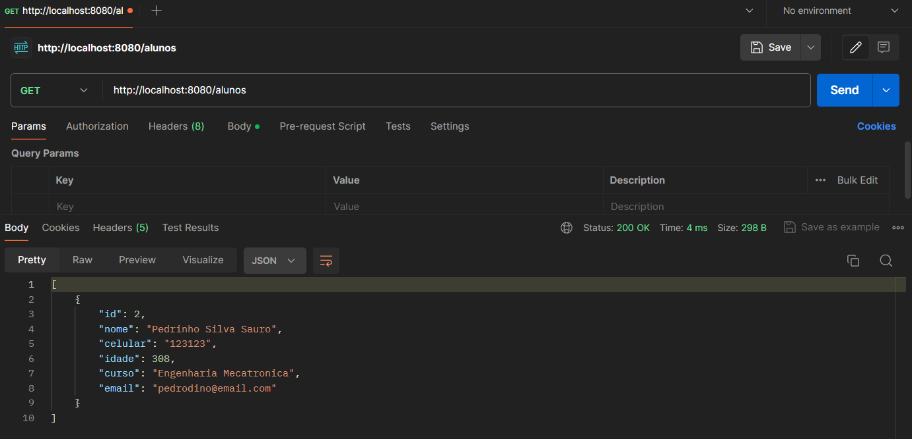
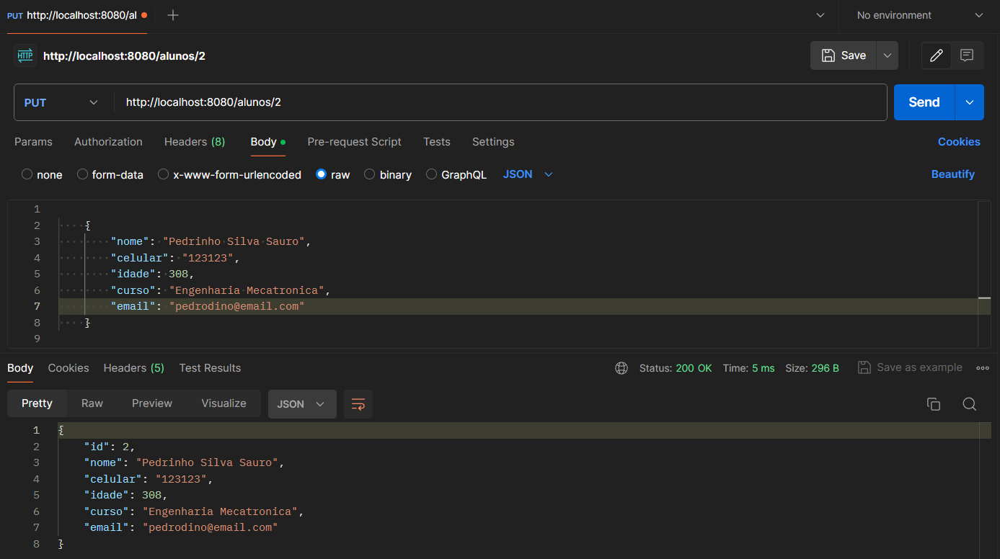

# AC1 - Etapa IV - Inversão de Controle e Injeção de Dependências
Nessa etapa, foram criadas as interfaces, repositórios e services, além de um retrabalho nos métodos da versão anterior.

## Classes
### Classe Main

### Interface Repository

### Implementação Repository

### Interface Service

### Implementação Service

### Nova versão do Controller

## Requisições

### Get de todos os Alunos

### Get Específico

### Add Aluno

### Delete + Select de todos

### Edit

