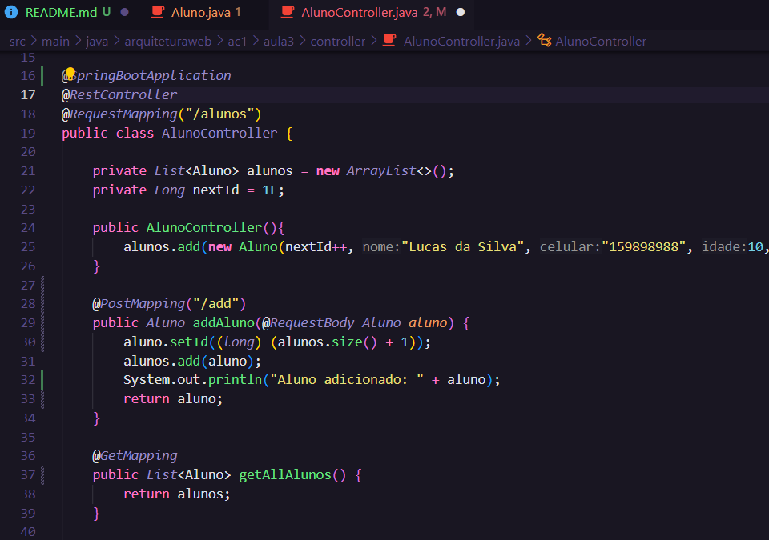
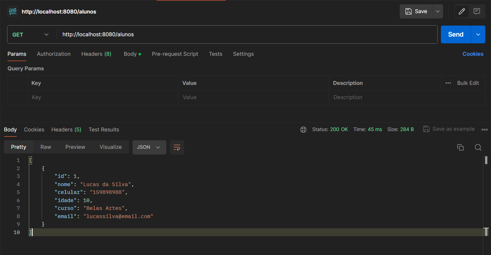
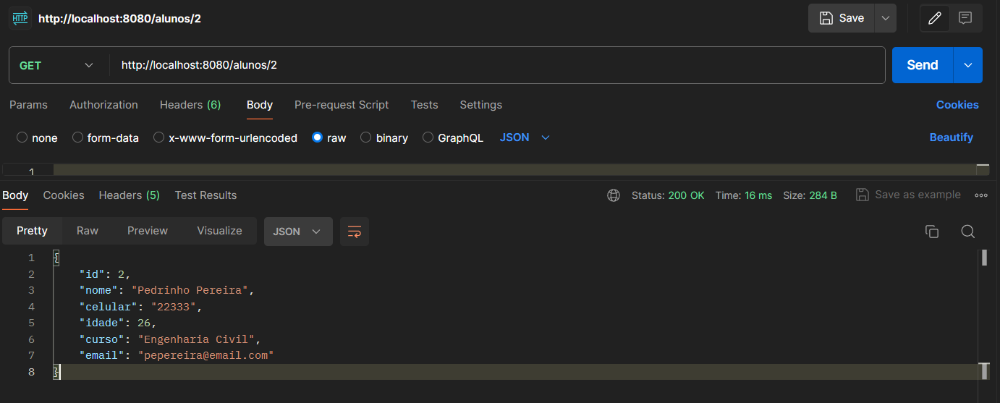
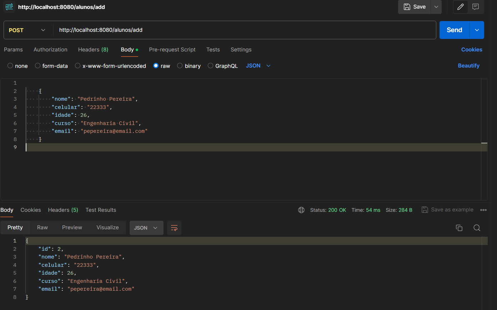
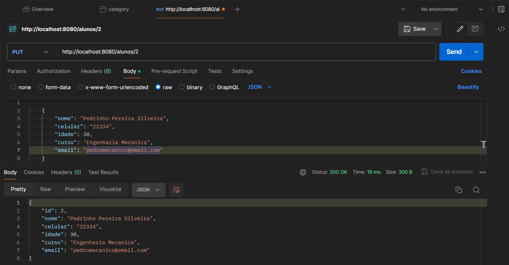

### (Disclaimer para o professor:)
Essa era aquela atividade que não funcionava de jeito nenhum, consegui fazer funcionar mesmo que sem entender o por quê, para ver a solução olhe o AlunoController.Java

# AC1 - Etapa III - CRUD de Alunos

### Model Aluno

### Controller Aluno

## Endpoints

### Get de todos os Alunos

### Get Aluno por ID

### Add Aluno

### Delete e Select de todos

### Put Aluno

