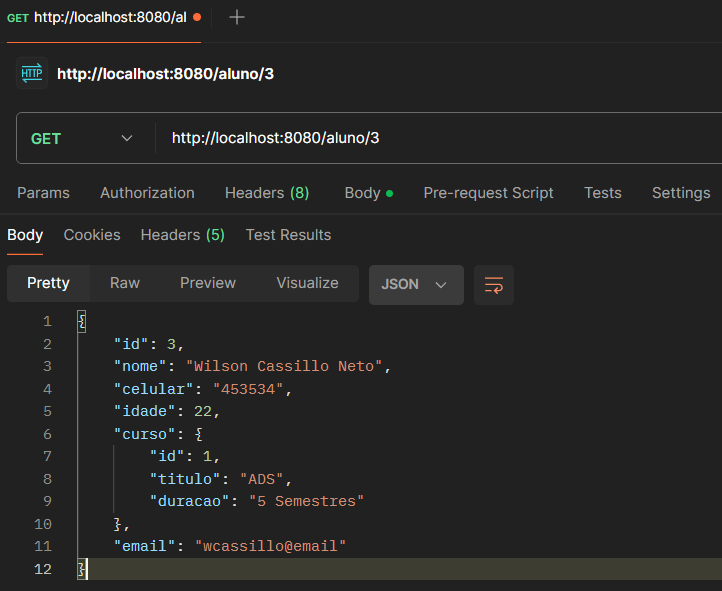

# AC2 - Aula 8 + Validation
Atividade para nota da Ac2.

Integrantes do Grupo:
- Guilherme Garcia Ortega de Oliveira 222258
- Matheus Jorge da Silva 152922
- Vanessa Cristina da Silva 223543
- Wilson Cassillo Neto 223198

## Models

### Model Aluno

### Model Curso

## Controllers

### Controller Aluno

### Controler Curso

## Services

### Services Aluno

### Services Curso

## Repositories

### Repository Aluno

### Repository Curso

## Endpoints Aluno

### Get All

### Get Id

### Add
   

### Edit

### Delete e Get All (Pra mostrar remoção)

### Get By Nome

### Get By Parte do Nome

### Get By Celular

### Get By Idade 

### Get Alunos By Curso Id

### Get By Email

### Get By Parte Email

### Get Alunos By Titulo Curso

### Count Alunos By Curso Id

### Count Alunos By Curso Titulo

## Endpoints Curso

### Get All

### Get por Id

### Add

### Edit

### Delete (e Get All para demonstrar a remoção)

## Validação

### Validação Aluno

### Validação Curso

